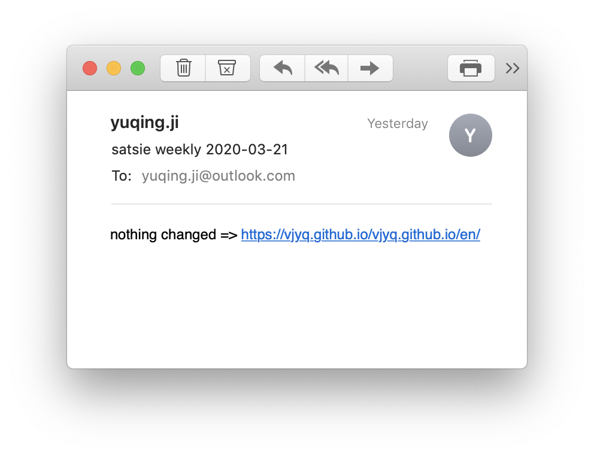

Facing tons of information everyday, I prefer focusing on some of
them. I use tool to bunch information and for me, there are 2 requirements for the tool:
- Check if my subscriptions are up to date.
- Keep eyes on different platforms. It is usually not that
  easy to find RSS feed, let alone other platforms like twitter,
  youtube, medium, etc. which a sign-up is
  always required for specific contents, causing unnecessary
  costs on account management.
  
Almost every RSS reader I tried can do the 1st thing but it
  surprised me that I found none of them could meet my 2nd requirement
  perfectly (to some extent). So I created [satsie](https://github.com/vjyq/satsie).

In simple, satsie would just do 1 thing once setup: compare a source between 2
timestamps, at the HTML level. And that's why it can catch updates
unless there's a mask on the site.

On top of a simple installation, I set up a cronjob to get email notification once
there's an update. Here's my OS and what I did:

My OS:
```
$ sw_vers
ProductName:	Mac OS X
ProductVersion:	10.14.4
BuildVersion:	18E226
```

What I did:
1. Created a mail trigger called [weekly.sh](https://github.com/vjyq/satsie/blob/master/bin/weekly.sh) in the dir `satsie/bin`
2. Set the trigger as a cronjob. Mine is every Saturday at 8 PM:
```
satsie $ crontab -e
0 20 * * 6 . /Users/yuqing.ji/satsie/bin/weekly.sh
```

And the mail in the mailbox:


<div style="border-top:1px solid #e1e4e8;padding-top:0.3em"></div>
<div style="padding-top:0.3em">© 2018-2020 by YUQING JI</div>
<div style="padding-top:0.3em"><a href="https://vjyq.github.io/vjyq.github.io/en/">Blog</a> | <a href="mailto:yuqing.ji@outlook.com">Email</a> | <a href="https://github.com/vjyq">Github</a></div>